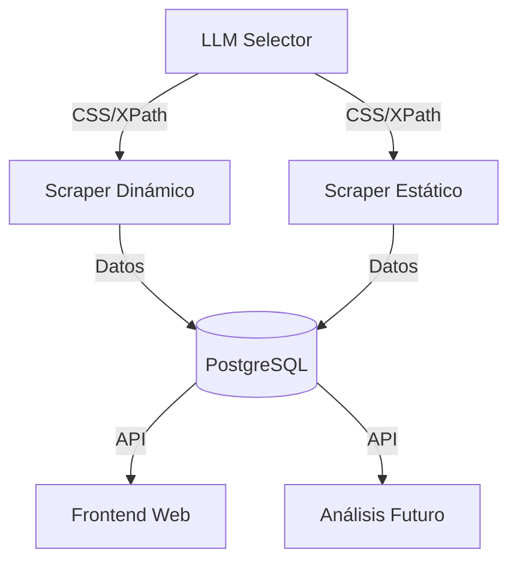

# Web Scraping Dinámico y Estático con Almacenamiento en PostgreSQL 🚀


Un proyecto de **Rafael Antonio**, **Nathalia Ramírez** y **Alonso Morales** que realiza *scraping* tanto en sitios web estáticos como dinámicos, utilizando modelos de lenguaje (LLMs) para sugerir selectores CSS/XPath y almacenando toda la información en PostgreSQL.

---

## 🌟 Características Principales

- 🕸️ **Scraping dual**: soporte para sitios estáticos y dinámicos (JavaScript)
- 🤖 **Integración con LLMs**: generación automática de selectores CSS/XPath
- 🗃️ **Almacenamiento robusto**: PostgreSQL para datos estructurados
- ⏰ **Scheduling**: ejecución programada de scraping
- 🌐 **API REST**: acceso a los datos recolectados
- 🖥️ **Interfaz web**: visualización de resultados con frontend

---

## 🏗️ Estructura del Proyecto

```plaintext
├── scraper/                  
│   ├── scraper_dynamic.py     # Scraping dinámico (Selenium)
│   ├── scraper_static.py      # Scraping estático (BeautifulSoup)
├── data/                     
│   ├── results.json           # Resultados de productos
│   ├── files.json             # Archivos descargados
│   ├── events.json            # Eventos del sistema
├── db/                       
│   ├── database.py            # Conexión a PostgreSQL
│   ├── logger.py              # Sistema de logging
├── api/                      
│   └── json_api_server.py     # API REST para los datos
├── docs/                     
│   └── GUÍA_INICIO.md         # Guía de inicio rápido
├── downloads/                 # Archivos descargados
├── llm/                      
│   └── llm_selector.py        # Generador de selectores
├── frontend/                 
│   ├── index.html             # Página principal
│   ├── styles.css             # Estilos CSS
│   ├── main.js                # Lógica principal
│   ├── results.js             # Visualización de resultados
│   ├── files.js               # Manejo de archivos
│   ├── calendar.js            # Calendario de eventos
├── logs/                     
│   └── scraper.log            # Log de operaciones
├── scheduler.py               # Programador de tareas
├── main.py                   # Punto de entrada principal
├── db_credentials.txt         # Credenciales de DB
├── requirements.txt           # Dependencias
├── serve_frontend.py          # Servidor web frontend
├── .env                       # Variables de entorno
└── README.md                  # Este archivo
```

---

## 🛠️ Configuración Inicial

### 🔽 Clonar el repositorio

```bash
git clone https://github.com/NatiVargas/ProyectoScrapingMonge.git
cd ProyectoScrapingMonge
```

### 💻 Crear entorno virtual (opcional pero recomendado)

```bash
python -m venv venv
# Linux/macOS
source venv/bin/activate
# Windows
.\env\Scripts\ctivate
```

### 📦 Instalar dependencias

```bash
pip install -r requirements.txt
```

### 🗄️ Configurar PostgreSQL

Crear un archivo llamado `db_credentials.txt` con el siguiente contenido:

```
tienda
postgres
contraseña_postgres
localhost
5432
```

### 🔑 Configurar LLM (opcional)

Crear un archivo `.env` con tu clave:

```
MISTRAL_API_KEY=TU_API_KEY
MISTRAL_MODEL=MODELO_DE_IA
```

---

## 🚀 Cómo Usar

| Comando | Descripción |
|--------|-------------|
| `python main.py` | Ejecuta el sistema completo |
| `python scraper/scraper_dynamic.py` | Ejecuta scraping dinámico (Selenium) |
| `python scraper/scraper_static.py` | Ejecuta scraping estático (BeautifulSoup) |
| `python scheduler.py` | Inicia el programador de tareas |
| `python api/json_api_server.py` | Levanta el servidor API |
| `python serve_frontend.py` | Inicia el servidor web del frontend |

---

## 🤖 ¿Por qué Selenium?

- Ideal para sitios con JavaScript pesado  
- Permite interacción con paginación dinámica  
- Soporte para scroll infinito  
- Precisión al capturar el DOM en tiempo real  

> Para sitios estáticos usamos **BeautifulSoup** por su eficiencia y rapidez.

---

## 🗃️ Arquitectura del Sistema



---

## 👥 Contribuidores

- **Rafael Antonio** — Scraping dinámico  
- **Nathalia Ramírez** — Base de datos y API  
- **Alonso Morales** — Frontend e integración con LLM

---

## 📌 Nota Final

Este proyecto forma parte del curso de **Computación en la Nube**.  
Para cualquier consulta, no dudes en contactar al equipo.  
¡Gracias por visitar el repositorio! 🙌
